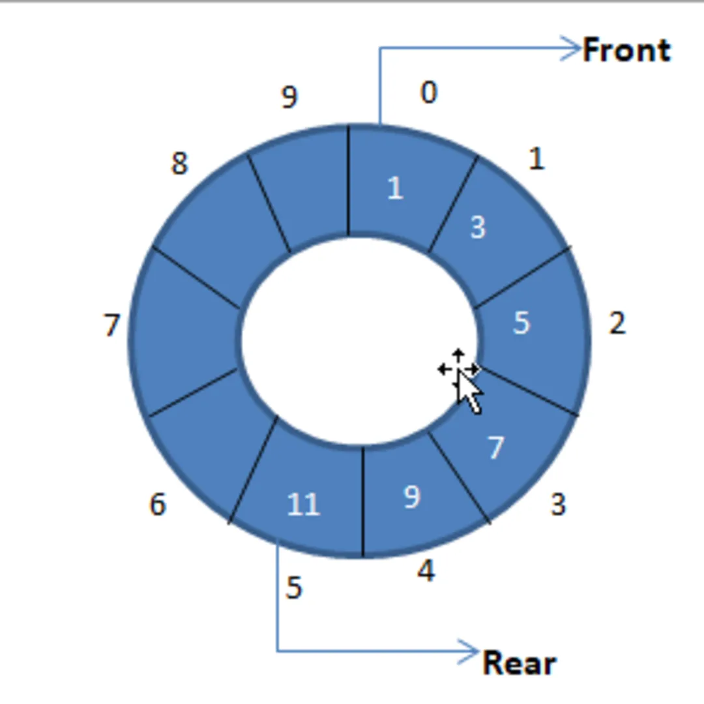
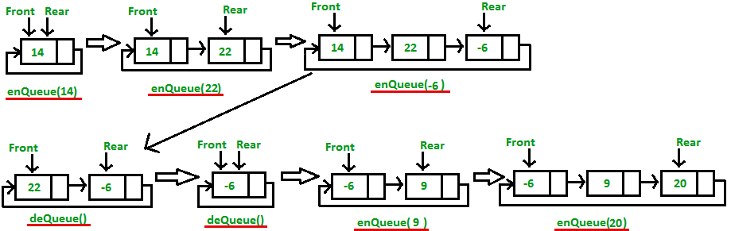
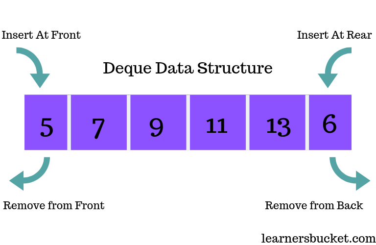

# Queues

- **FIFO** (**F**irst **I**n, **F**irst **O**ut). **Example**: Real queues, like in a restaurant or a party.

## Conditions:

- `size = 0` → empty queue
- `size = queue size` → full queue
- `size = 0 && front = -1 && rear = -1` -> Initial state of the queue

___

# Static circular queue

- The queue size is **fixed** and **allocated** before. 
- The **enqueue increments** the index of the last element and **insert** the data in this **new index** (rear).
- The **dequeue** increments the **front position**
- If insert value in the last index, we move this new element in the first index (0), instead de last (capacity). 

___

___

# Dynamic queue

- The queue size is **not fixed**. 
- We use a **node** to carry the **memory** **address** of the elements.

___

___

# Deque queue

- In deque we can **insert** **and** **delete** in the **front** **and** the **rear**.
- Looks like a structure with 2 queues in a inverse side.

___

