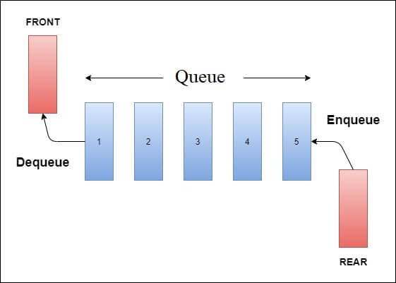

# Queues

- **FIFO** (**F**irst **I**n, **F**irst **O**ut). **Example**: Real queues, like in a restaurant or a party.

- With a **Circular queue**, if the next element has no space, the new position will be the index 0 (first position).

## Conditions:

- `size = 0` → empty queue
- `size = queue size` → full queue
- `size = 0 && front = -1 && rear = -1` -> Initial state of the queue

___

# Dynamic queue

- The queue size is **not fixed**. We use a **node** to carry the **memory** **address** of the elements.

___

# Deque

- In deque we can **insert** **and** **delete** in the **front** **and** the **rear,** like a structure with 2 queues in a inverse side.
