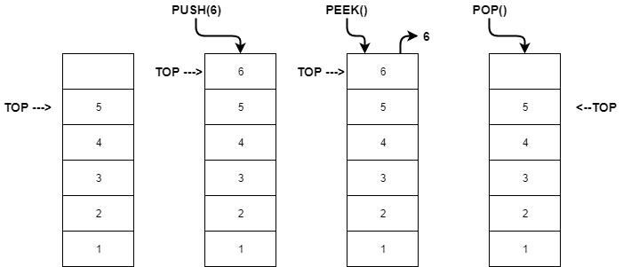
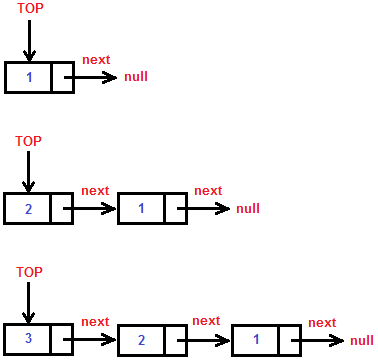

# Pilhas (Stack) - Listas

- The **last** element to **enter**, is the **first** to **leave**.
- **LIFO** (**L**ast **I**n, **F**irst **O**ut). Examples: Browser history, `CTRL + Z`
- Stack Underflow: Pop in a empty list.
- Stack Overflow: Push in a full list.

___

___

## Stack static

- The size is **fixed**.
- Try to insert a **new** element in a **full** stack throws an **overflow** exception.

___

## Stack dynamic

- The size is **not fixed.**
- Each element has a **pointer**, pointing out to the **next** element of the stack.

___

