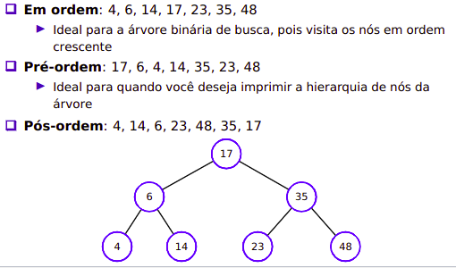

# Trees

- Trees has similar to the **node** **structure** of lists
- The **principal** node is called **Root**
- **Below**, we have the **subtrees**
- Each node has a node pointing to him

- All nodes has **0 or more children**
- All nodes has just **one** **father**
- The **node degree** is defined by the **number** of **children** what he have
- Nodes with the **same** **father** are **brothers**
- Nodes with **degree** **zero** can be called **leaf**
- **Path**: A sequence of nodes. The **size** of this **path** is the **number of arcs**
- **Depth:** To each node of a tree, exists a **unique path between root and this node**. The **size** of this **path** is called Depth.
- **Height:** The **depth max** in any node

___

## Binary Tree

- A binary tree has **bellow** **each node,** **maximum** of **2 subtrees.**
- Each node has **1 key** and **2 pointers**, one for the subtree in **left** and one for subtree in **right**

___
    
